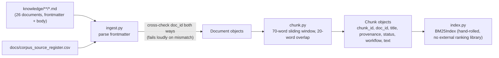
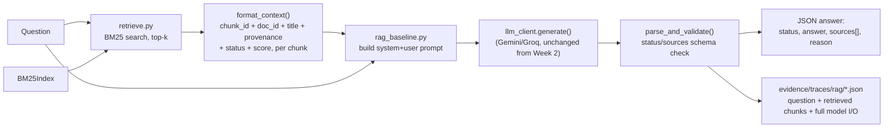

# UniFlow — Week 3 RAG Architecture

This implements the "Knowledge Base / RAG" component that
`04_Initial_Architecture_Description GROUP I.docx` already named in Week 1
(§3: *"Stores and retrieves approved requirements, business rules, project
documentation and other controlled QA context"*) and that the Week 2 rule
pack explicitly said it was groundwork for
(`prompts/context/uniflow_rules.md` line 9).

## What changed from Week 2

Week 2's `src/baseline.py` injected the **entire** `uniflow_rules.md` file
into every prompt (`load_rule_pack()` → `rule_pack` in `USER_TEMPLATE`). That
is not retrieval — it's "context stuffing," and it doesn't scale past a
handful of rules, doesn't let the model tell you *which* rule it actually
used, and can't fail informatively when a question is out of scope.

Week 3 replaces that with real retrieval: the model only ever sees the
top-k chunks a retriever selected for *that specific question*, and the
output contract requires it to name the `doc_id`s it relied on.

## Ingestion-time flow (build the index)

## Query-time flow (answer a question)

## Why BM25 over embeddings

The corpus is small (tens of chunks) and full of exact, distinctive
identifiers (`R-04`, `BSE1101`, `PS`/`EVE`, specific times). Lexical
retrieval matches this content reliably and needs zero extra dependencies —
`src/rag/index.py` is a ~50-line hand-rolled BM25 implementation, consistent
with `llm_client.py`'s "deliberately boring" philosophy and easy to explain
at the demo. Embeddings were considered and rejected for Week 3: they'd add
a model-download or API-cost dependency for a corpus this small and
structured, without a clear retrieval-quality benefit. Worth revisiting if
the corpus grows into free-text policy prose in a later week.

## Where grounding is actually enforced

Two places, on purpose — this is the finding Week 2 already anticipated
(`RUNBOOK.md` line 256, re: PE-02's `rule_source` check):

1. **Retrieval**: only the top-k chunks relevant to *this* question enter
   the prompt — the model cannot casually fall back on the full rule pack.
2. **Generation**: the system prompt requires every claim to cite a
   retrieved `doc_id`, and explicitly instructs the model that
   `status: draft-unapproved` chunks (see the Source Register) must never be
   presented as approved rules. Retrieval alone doesn't guarantee grounding
   — a model can still ignore correct context, which is exactly the third
   failure category Week 3 asks us to hunt for (see `Week3_Failures.md`).

## File map

| Stage | File |
|---|---|
| Corpus | `knowledge/**/*.md` |
| Source register | `docs/corpus_source_register.csv` |
| Ingestion | `src/rag/ingest.py` |
| Chunking | `src/rag/chunk.py` |
| Indexing / retrieval | `src/rag/index.py`, `src/rag/retrieve.py` |
| Prompt construction + generation | `src/rag_baseline.py` |
| 15-case evaluation | `eval/rag_eval_cases.json`, `src/rag_eval_runner.py` |
| Traces (grounding evidence) | `evidence/traces/rag/*.json` |
