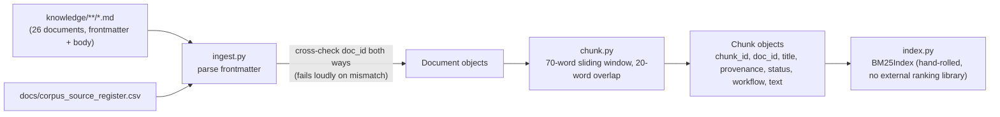
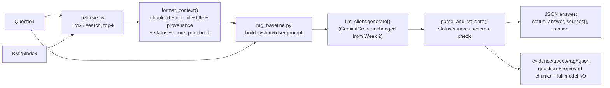
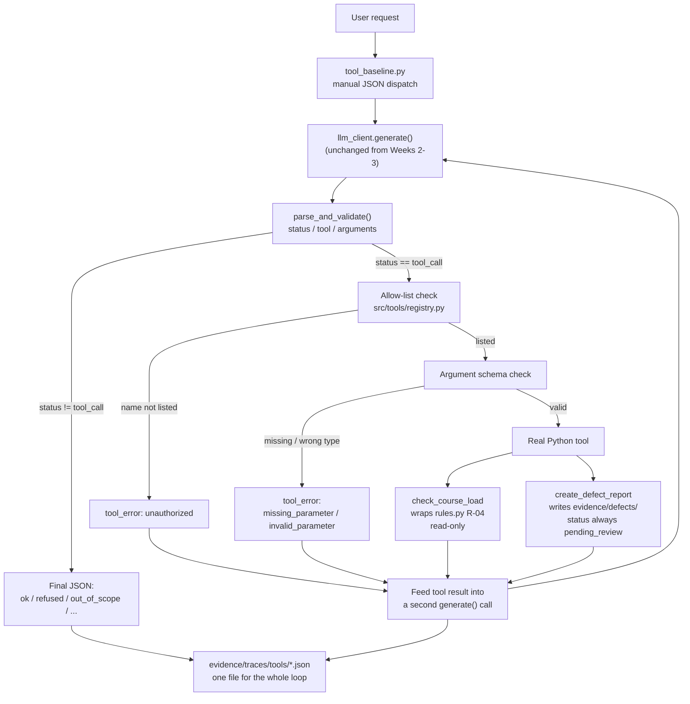
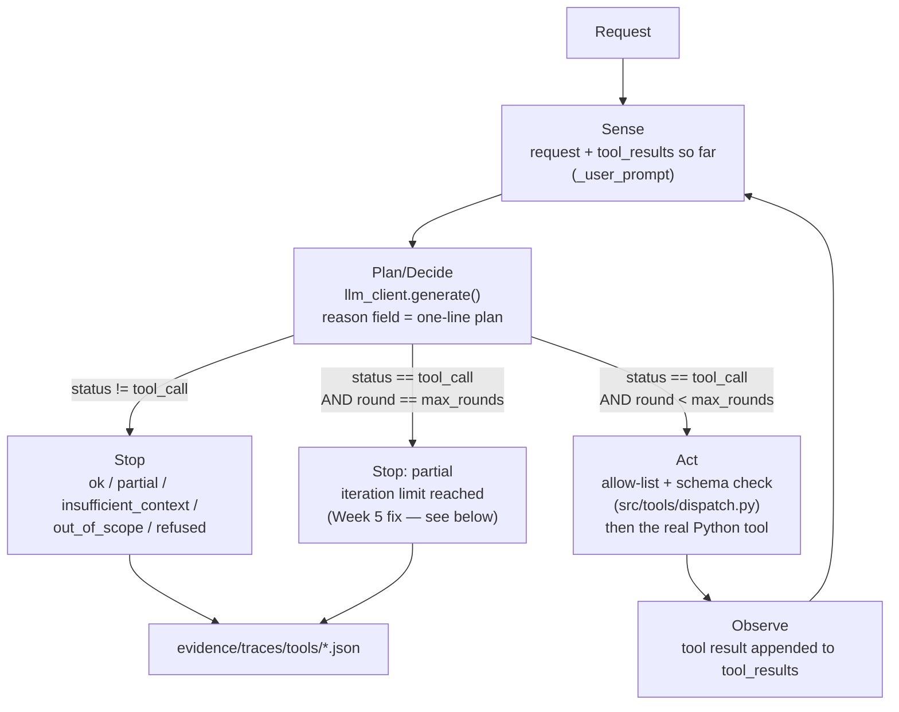

# UniFlow — Week 3 RAG Architecture

This implements the "Knowledge Base / RAG" component that
`04_Initial_Architecture_Description GROUP I.docx` already named in Week 1
(§3: *"Stores and retrieves approved requirements, business rules, project
documentation and other controlled QA context"*) and that the Week 2 rule
pack explicitly said it was groundwork for
(`prompts/context/uniflow_rules.md` line 9).

## What changed from Week 2

Week 2's `src/baseline.py` injected the **entire** `uniflow_rules.md` file
into every prompt (`load_rule_pack()` → `rule_pack` in `USER_TEMPLATE`). That
is not retrieval — it's "context stuffing," and it doesn't scale past a
handful of rules, doesn't let the model tell you *which* rule it actually
used, and can't fail informatively when a question is out of scope.

Week 3 replaces that with real retrieval: the model only ever sees the
top-k chunks a retriever selected for *that specific question*, and the
output contract requires it to name the `doc_id`s it relied on.

## Ingestion-time flow (build the index)

```mermaid
flowchart LR
    A["knowledge/**/*.md<br/>(26 documents, frontmatter + body)"] --> B["ingest.py<br/>parse frontmatter"]
    R["docs/corpus_source_register.csv"] --> B
    B -->|"cross-check doc_id both ways<br/>(fails loudly on mismatch)"| C["Document objects"]
    C --> D["chunk.py<br/>70-word sliding window, 20-word overlap"]
    D --> E["Chunk objects<br/>chunk_id, doc_id, title, provenance, status, workflow, text"]
    E --> F["index.py<br/>BM25Index (hand-rolled, no external ranking library)"]
```

## Query-time flow (answer a question)

```mermaid
flowchart LR
    Q["Question"] --> R2["retrieve.py<br/>BM25 search, top-k"]
    F2["BM25Index"] --> R2
    R2 --> CTX["format_context()<br/>chunk_id + doc_id + title + provenance\n+ status + score, per chunk"]
    CTX --> P["rag_baseline.py<br/>build system+user prompt"]
    Q --> P
    P --> LLM["llm_client.generate()<br/>(Gemini/Groq, unchanged from Week 2)"]
    LLM --> V["parse_and_validate()<br/>status/sources schema check"]
    V --> OUT["JSON answer:<br/>status, answer, sources[], reason"]
    V --> TR["evidence/traces/rag/*.json<br/>question + retrieved chunks + full model I/O"]
```

## Why BM25 over embeddings

The corpus is small (tens of chunks) and full of exact, distinctive
identifiers (`R-04`, `BSE1101`, `PS`/`EVE`, specific times). Lexical
retrieval matches this content reliably and needs zero extra dependencies —
`src/rag/index.py` is a ~50-line hand-rolled BM25 implementation, consistent
with `llm_client.py`'s "deliberately boring" philosophy and easy to explain
at the demo. Embeddings were considered and rejected for Week 3: they'd add
a model-download or API-cost dependency for a corpus this small and
structured, without a clear retrieval-quality benefit. Worth revisiting if
the corpus grows into free-text policy prose in a later week.

## Where grounding is actually enforced

Two places, on purpose — this is the finding Week 2 already anticipated
(`RUNBOOK.md` line 256, re: PE-02's `rule_source` check):

1. **Retrieval**: only the top-k chunks relevant to *this* question enter
   the prompt — the model cannot casually fall back on the full rule pack.
2. **Generation**: the system prompt requires every claim to cite a
   retrieved `doc_id`, and explicitly instructs the model that
   `status: draft-unapproved` chunks (see the Source Register) must never be
   presented as approved rules. Retrieval alone doesn't guarantee grounding
   — a model can still ignore correct context, which is exactly the third
   failure category Week 3 asks us to hunt for (see `Week3_Failures.md`).

## File map

| Stage | File |
|---|---|
| Corpus | `knowledge/**/*.md` |
| Source register | `docs/corpus_source_register.csv` |
| Ingestion | `src/rag/ingest.py` |
| Chunking | `src/rag/chunk.py` |
| Indexing / retrieval | `src/rag/index.py`, `src/rag/retrieve.py` |
| Prompt construction + generation | `src/rag_baseline.py` |
| 15-case evaluation | `eval/rag_eval_cases.json`, `src/rag_eval_runner.py` |
| Traces (grounding evidence) | `evidence/traces/rag/*.json` |

---

# Week 4 addition — tool-calling loop

Week 4 sits **on top of** the query-time RAG flow above. It does not replace
retrieval. The model may still answer from retrieved context; when the request
needs a rule check or a durable draft, it returns a `tool_call` JSON object
instead of a final answer, and Python runs a real function.

This is the agentic loop already named in
`04_Initial_Architecture_Description GROUP I.docx` §5:
retrieve context → plan → call an approved tool → inspect result → decide
whether another step is necessary → stop/report.

```mermaid
flowchart TD
    U["User request"] --> ORCH["tool_baseline.py<br/>manual JSON dispatch"]
    ORCH --> LLM["llm_client.generate()<br/>(unchanged from Weeks 2-3)"]
    LLM --> PARSE["parse_and_validate()<br/>status / tool / arguments"]
    PARSE -->|"status != tool_call"| OUT["Final JSON:<br/>ok / refused / out_of_scope / ..."]
    PARSE -->|"status == tool_call"| AL["Allow-list check<br/>src/tools/registry.py"]
    AL -->|"name not listed"| ERR["tool_error: unauthorized"]
    AL -->|"listed"| SCH["Argument schema check"]
    SCH -->|"missing / wrong type"| ERR2["tool_error:<br/>missing_parameter / invalid_parameter"]
    SCH -->|"valid"| FN["Real Python tool"]
    FN --> CCL["check_course_load<br/>wraps rules.py R-04<br/>read-only"]
    FN --> CDR["create_defect_report<br/>writes evidence/defects/<br/>status always pending_review"]
    CCL --> BACK["Feed tool result into<br/>a second generate() call"]
    CDR --> BACK
    ERR --> BACK
    ERR2 --> BACK
    BACK --> LLM
    OUT --> TR["evidence/traces/tools/*.json<br/>one file for the whole loop"]
    BACK --> TR
```

Human approval sits **outside** the loop. `scripts/review_defect.py` can set
`approved` or `rejected`. It is not in the allow-list, so the model cannot
call it. That is the Week 1 Boundary Matrix row already agreed:
*"Draft defect reports — Allowed... Human reviews/accepts defects."*

## Native function-calling — considered, not used

Gemini `functionDeclarations` / Groq OpenAI-style `tools` were considered and
rejected for Week 4. `llm_client.py` already has two provider-specific call
paths; native tool-calling would add a third schema per provider. Manual
JSON-dispatch uses the same output-contract pattern as `baseline.py` and
`rag_baseline.py`, works identically for either model, and matches the
Week 1 allow-listed loop rather than a vendor API. Worth revisiting only if
a later week needs parallel multi-tool calls that the JSON contract cannot
express cleanly.

## Week 4 file map

| Stage | File |
|---|---|
| Tool contracts | `docs/Week4_Tool_Catalogue.md` |
| Allow-list + dispatch | `src/tools/registry.py`, `src/tools/dispatch.py` |
| Tool 1 (read) | `src/tools/check_course_load.py` → `uniflow_core.rules.check_course_load` |
| Tool 2 (draft side effect) | `src/tools/create_defect_report.py` |
| Orchestration | `src/tool_baseline.py` |
| Human-only approval | `scripts/review_defect.py` (not a tool) |
| Evaluation | `eval/tool_eval_cases.json`, `src/tool_eval_runner.py` |
| Traces | `evidence/traces/tools/` |

---

# Week 5 addition — bounded agent loop (Sense → Plan → Act → Observe → Stop)

Week 4's tool-calling loop already *was* an agent loop in substance; Week 5
makes the five stages explicit, fixes a real gap in how it stopped, and
exercises it on a task that genuinely needs re-planning rather than a fixed
two-call sequence. See `docs/Week5_Agent_Task_Contract.md` for the goal,
state, limits and stop conditions this diagram implements.

```mermaid
flowchart TD
    REQ["Request"] --> SENSE["Sense<br/>request + tool_results so far<br/>(_user_prompt)"]
    SENSE --> PLAN["Plan/Decide<br/>llm_client.generate()<br/>reason field = one-line plan"]
    PLAN -->|"status != tool_call"| STOP["Stop<br/>ok / partial / insufficient_context /<br/>out_of_scope / refused"]
    PLAN -->|"status == tool_call<br/>AND round < max_rounds"| ACT["Act<br/>allow-list + schema check<br/>(src/tools/dispatch.py)<br/>then the real Python tool"]
    PLAN -->|"status == tool_call<br/>AND round == max_rounds"| LIMIT["Stop: partial<br/>iteration limit reached<br/>(Week 5 fix — see below)"]
    ACT --> OBSERVE["Observe<br/>tool result appended to tool_results"]
    OBSERVE --> SENSE
    STOP --> TR["evidence/traces/tools/*.json"]
    LIMIT --> TR
```

**The Week 5 fix.** Before this week, a `tool_call` arriving on the last
allowed round fell through to `continue` in *live* mode — the loop kept
going past `max_rounds` with no enforced ceiling, and if the model never
volunteered a terminal status, `handle_request()` could return
`parsed_output: None`: a trace with no answer at all, for a system whose
entire premise is bounded, explainable autonomy. `handle_request()` now
intercepts a `tool_call` at `round == max_rounds` *before* dispatching it,
stopping with `status: "partial"` and every tool result gathered so far —
and a final fallback guarantees `parsed_output` is never `None` even if the
model's response is unparseable. Regression tests:
`tests/test_tools.py::test_loop_stops_safely_when_model_keeps_requesting_tools`
and `::test_loop_stops_safely_when_model_response_is_unparseable`.

**Why this needed a genuine two-tool task, not just a longer loop.** Simply
raising `MAX_TOOL_ROUNDS` would not demonstrate multi-step *decision*
making — a loop that always calls both tools regardless of the first
result isn't planning, it's a fixed script. The Week 5 task (check a
course-load request, draft a defect *only if* it is violated) requires the
agent to Observe the first tool's result and Re-plan from it: call a second
tool, or stop having decided no further action is warranted. Both branches
are captured in this week's traces — see `docs/Week5_Agent_Task_Contract.md`.

## Week 5 file map

| Stage | File |
|---|---|
| Task contract | `docs/Week5_Agent_Task_Contract.md` |
| Agent loop (extended) | `src/tool_baseline.py` — `handle_request()` |
| Tools (unchanged from Week 4) | `src/tools/check_course_load.py`, `src/tools/create_defect_report.py` |
| New regression tests | `tests/test_tools.py` (safe-stop behaviour) |
| Execution traces | `evidence/traces/tools/` (three new traces, see the task contract) |
| Draft records | `evidence/defects/` |
